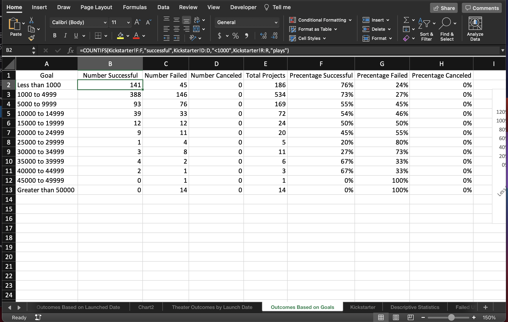
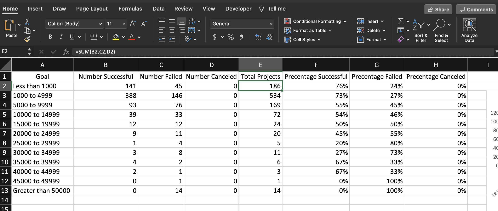
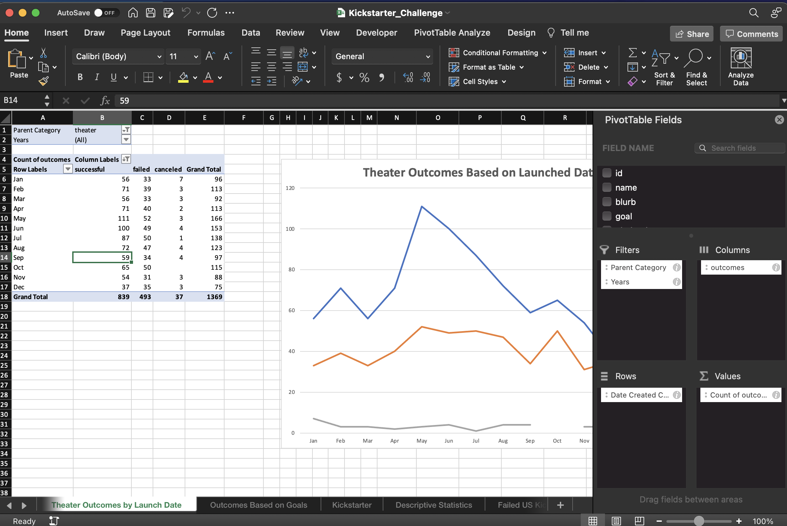

# Kickstarting with Excel

## Overview of Project

- Determine the trend of the outcomes based on goal and date.

### Purpose

- To help Louise see how other campaigns did with their launch dates in respect to their funding goals since her play fell short of their goal.

## Analysis and Challenges

#Analysis

- 
- 
- 

#Challenges

- I faced a couple of challenges completing the work. My first will be the countifs function due to getting the equation references correctly. Inputing the right code/annotation for the equation. Once I practiced manually inputing the function a couple of times into the cells I understood the correlation of the numbers in the function for filtering. My second challenge has been writing out the read me section. I'm not sure how detail they need to be or if I'm adding images correctly. I just included everything that I saved and what I think is the explanation needed for my findings.

## Results

1. What are two conclusions you can draw about the Outcomes based on Launch Date?

- Launching theater campaigns in May seem to have greater success reaching their goal than launching in December where it fall close to the failed campagins. Around March and September theater campaigns show major decrease in reaching goal for both successful and failed outcomes.

2. What can you conclude about the Outcomes based on Goals?

- In the graph we see that Percentage failed has mirrored or reflection value result of the percentage successful results.

3. What are some limitations of this dataset?

- We are currently looking at one type of category instead of in comparison to another dataset. We limited the data to just the number of outcomes and not taking the average or quartiles of the data.

4. What are some other possible tables and/or graphs that we could create?

- We could use a box plot if we gathered data on the mean and quartiles of the data set to see what outliers take into effect with the dataset
